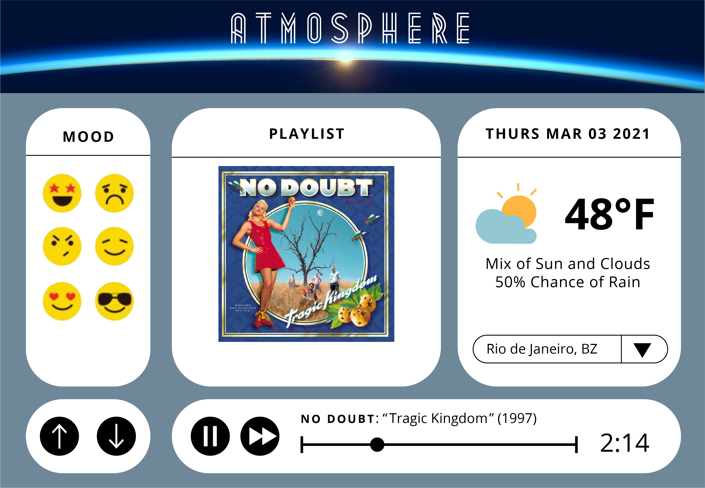
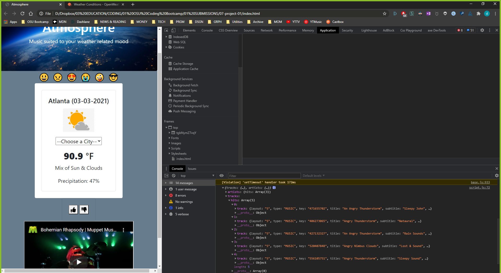
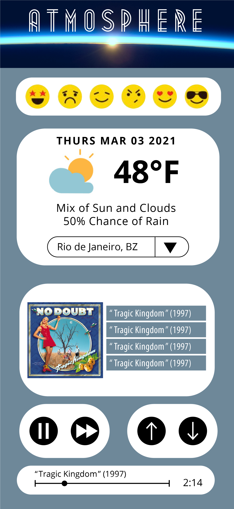

# Project 1 : Atmosphere App

## Description

We have created a website that allows users to discover music suited to both their mood and the current weather of their
area. Upon opening the website, the user is presented with six unique emoticon-buttons that they can select based on what their 
mood is, and there is a dashboard window underneath displaying the current weather conditons of their city. Once the mood is selected, 
the website immediately navigates to a song suggested to the user based on the criteria provided.

### Features

This web application uses both the Open Weather Map API as well as the Shazam API. This required 2 unique API keys in order to run calls.
We have also included a dropdown list for the user to select various cities, and an embedded youtube video player can be seen underneath this 
so that the suggested song can be played right on the page.

### Visuals

### Links
[deployedApplication]    https://dishdesigner.github.io/Atmosphere/
